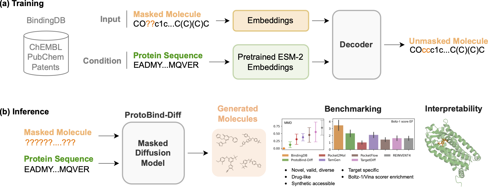

# ProtoBind-Diff: A Structure-Free Diffusion Language Model for Protein Sequence-Conditioned Ligand Design

Implementation of [ProtoBind-Diff: A Structure-Free Diffusion Language Model for Protein Sequence-Conditioned Ligand Design](link)  by Lukia Mistryukova*, Vladimir Manuilov*, Konstantin Avchaciov*, and Peter O. Fedichev.

ProtoBind-Diff is a masked diffusion language model that generates target-specific, high-quality small-molecule ligands. Trained entirely without structural input, it enables structure-independent ligand design across the full proteome and matches structure-based methods in docking and Boltz-1 benchmarks.

If you have questions, feel free to open an issue or send us an email at lukiia.mistriukova@gero.ai, konstantin.avchaciov@gero.ai, and vladimir.manuylov@gero.ai.

## Overview

This repository contains the evaluation toolkit and supporting data for **ProtoBind-Diff**. It is organized as follows:

### `data/`
We selected 12 protein targets to benchmark molecular generation quality across different models.
- One folder per model (`pocket2mol/`, `targetdiff/`, etc.) containing SMILES files of generated ligands
- `bindingdb/` – sets of true active molecules  
- `CrossDocked2020/` – cleaned PDB files and corresponding ligands for the targets 
- `fasta/` – FASTA sequences of the targets 

### `exe/`
- `run_docking.py` – batch docking wrapper for AutoDock Vina  
- `run_boltz.py` – prepares ligand sets and YAML configs for Boltz-1 evaluation
- `extract_pocket.py` – extracts binding pockets from protein–ligand complexes using PyMOL
- `collect_boltz_scores.py` - parses Boltz-1 output JSONs and aggregates per-ligand confidence scores across datasets

### `notebooks/`
Jupyter notebooks to reproduce the paper figures: docking/Boltz-1 score distributions, attention maps analysis, chemical property distributions, and UMAP-based target specifity analysis.
 

### `results/`
- Raw docking and Boltz-1 score tables for each method

---

A quick-start guide, environment setup instructions, license, and a citation will be added later.

